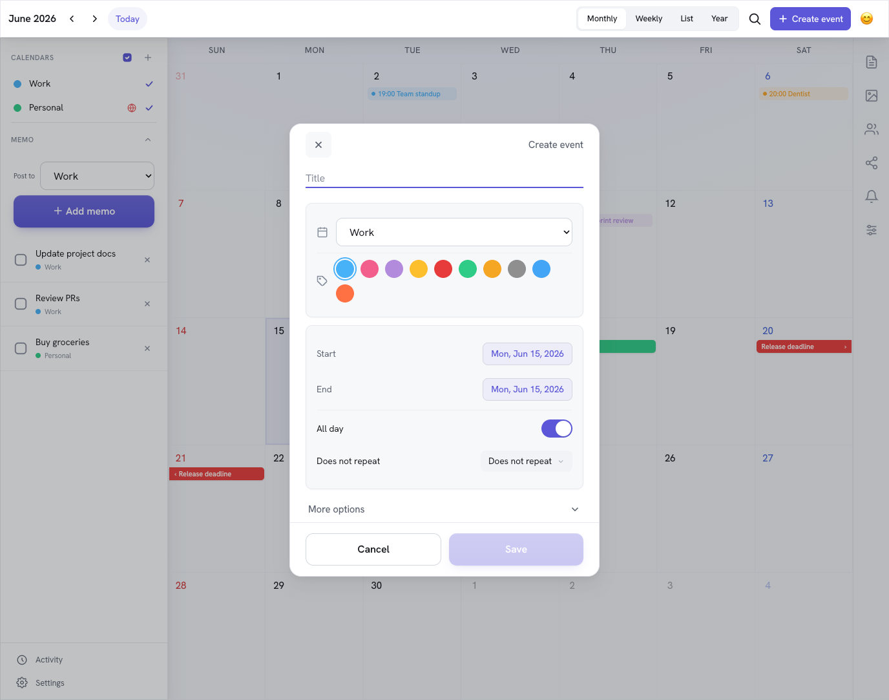
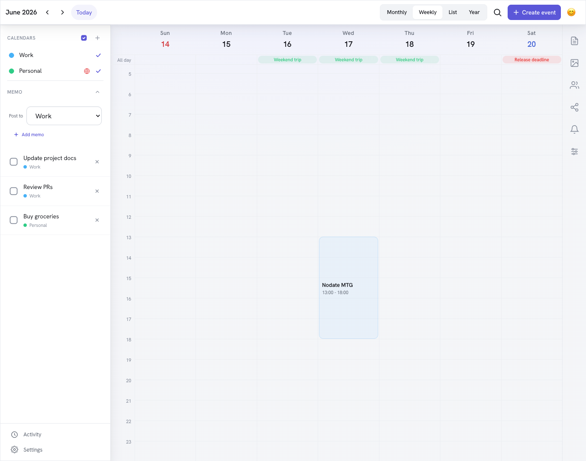
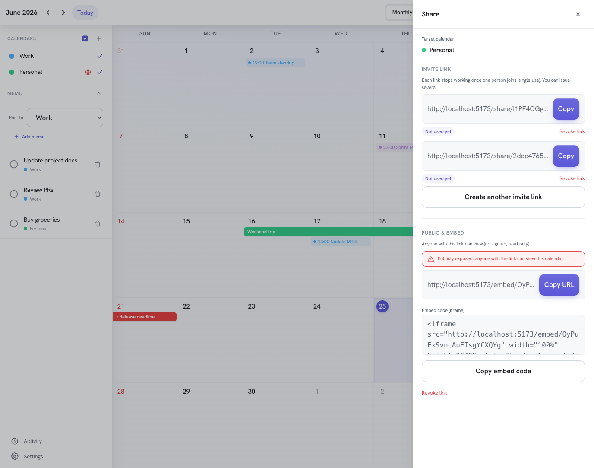
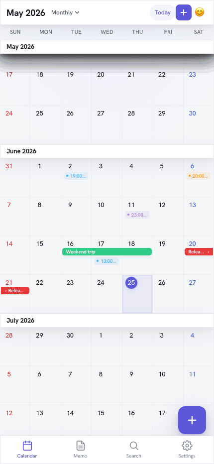

# Nodate Time

[](https://github.com/libraz/nodate-time/actions/workflows/ci.yml)
[](./LICENSE)


共有カレンダーアプリ。家族・チーム・タレント事務所など、複数人で 1 つのカレンダーを運用するためのグループカレンダー。Go 製の REST API と React SPA のモノレポ構成。

## スクリーンショット

| 月表示 | 週表示 |
| --- | --- |
|  |  |
| **共有・埋め込み** | |
|  | |

モバイル表示（縦スクロールの月表示）:

<p align="left">
  
</p>

## 主な機能

- **カレンダー共有** — メンバーごとのロール（owner / editor / viewer）、招待リンク発行、公開共有トークン、外部埋め込み（embed）ビュー
- **予定（イベント）** — 終日・時間指定、繰り返し（RRULE）と例外日編集、ドラッグでの移動・リサイズ、参加者・チェックリスト・添付ファイル・コメント
- **メモ** — カレンダー単位のメモ
- **アルバム** — カレンダーごとの写真アルバム（イベントへの紐付け可）
- **アクティビティ / 監査履歴** — イベント・メモの変更履歴とカレンダー単位のアクティビティフィード
- **認証** — メール+パスワード、Google / LINE の OAuth/OIDC ログイン、パスワードリセット、開発用パスワードレスログイン
- **管理者機能** — OAuth プロバイダ設定、サインイン許可メール/ドメインのアロウリスト
- **エクスポート / インポート** — iCal・CSV
- **多言語 / テーマ** — 日本語・英語の i18n、テーマ切り替え

## 技術スタック

| 領域 | 採用技術 |
| --- | --- |
| API | Go 1.25 + [Huma v2](https://huma.rocks)（OpenAPI）+ chi/v5 + [sqlc](https://sqlc.dev) |
| DB | MySQL 8.4（Docker Compose） |
| オブジェクトストレージ | S3 互換（ローカルは MinIO） |
| Web | React 19 + TypeScript + Vite + TanStack Router + Zustand + Tailwind CSS 4 + Luxon |
| Lint / Format | Biome（Web）/ gofmt（Go） |
| パッケージマネージャ | Bun |
| テスト | Go E2E（testify + 実 MySQL）/ Vitest（Web） |

## ディレクトリ構成

```
apps/
  api/                 Go REST API
    cmd/api/           エントリポイント
    cmd/createuser/    ユーザー作成 CLI
    internal/          config, auth, audit, cleanup, db/generated,
                       errors, mailer, recurrence, secrets, storage,
                       http/{handlers,middleware,router}
    tests/e2e/         E2E テスト
  web/                 React SPA
    src/components/     UI コンポーネント
    src/routes/         TanStack Router（file-based, share/ embed/ 含む）
    src/stores/         Zustand（auth / calendar / ui ストア）
    src/lib/            ユーティリティ（date, recurrence, upload, theme 等）
    src/i18n/           日本語 / 英語ロケール
sql/
  tables/              001-017 テーブル定義
  queries/             sqlc クエリ定義
  schema.sql           build-schema.sh で生成される結合スキーマ
  sqlc.yaml            sqlc 設定
compose.yml            MySQL + MinIO のローカルスタック
```

## セットアップ

### 必要なもの

- [Bun](https://bun.sh)
- Go 1.25+
- Docker（MySQL / MinIO 用）
- [sqlc](https://sqlc.dev)（コード生成する場合）

### 起動

```bash
bun install            # 依存インストール（Bun 必須）
make db-up             # MySQL 起動（compose.yml）
make db-apply          # スキーマ生成・適用
make db-seed-users     # demo@example.com / admin@example.com を作成
make dev               # DB + API + Web を一括起動
```

- API: <http://localhost:8080>（`/health`, OpenAPI は Huma が生成）
- Web: <http://localhost:5173>

開発環境（`TC_ENV=development`）では `/auth/dev-login` でシードユーザーにパスワードレスログインできる。

### よく使うコマンド

```bash
make dev               # DB + API + Web を並列起動
make db-up / db-down   # MySQL の起動 / 停止
make db-apply          # スキーマ適用（build-schema.sh → schema.sql）
make db-seed           # スキーマ適用 + ユーザー + サンプルデータ
make minio-up          # MinIO（S3 互換ストレージ）起動
make sqlc              # sqlc コード生成
make api / make web    # 個別起動
make build-api         # API バイナリビルド（bin/api）
make create-user ARGS="-email a@b.com -password secret123 -admin"
make format            # gofmt + Biome 自動修正
make lint              # gofmt チェック + Biome（書き込みなし）
make test-api          # Go ユニットテスト
make test-e2e          # E2E（要 MySQL + TC_TEST_INTEGRATION=1）
make test-e2e-storage  # MinIO を使うストレージ系も含めた E2E

bun run check          # Biome チェック
bun run typecheck      # TypeScript 型チェック（tsc -b）
cd apps/web && bun run test   # Web ユニットテスト（Vitest）
```

## 環境変数

すべて `TC_` プレフィックス。主要なもの（詳細・デフォルト値は `apps/api/internal/config/config.go`）:

| 変数 | 用途 | デフォルト |
| --- | --- | --- |
| `TC_ENV` | `development` で開発用機能を有効化 | `production` |
| `TC_PORT` | API ポート | `8080` |
| `TC_DB_DSN` | MySQL DSN | `ttuser:ttpw@tcp(127.0.0.1:33306)/timetree_clone?parseTime=true` |
| `TC_JWT_SECRET` | JWT 署名鍵（本番は 32 バイト以上必須） | dev フォールバック |
| `TC_PASSWORD_LOGIN_ENABLED` | メール+パスワード認証の有効化 | `true` |
| `TC_CORS_ALLOWED_ORIGINS` | CORS 許可オリジン（本番はワイルドカード不可） | localhost:5173 |
| `TC_WEB_URL` / `TC_API_PUBLIC_URL` | フロント / API の公開 URL | localhost |
| `TC_S3_ENDPOINT` / `TC_S3_ACCESS_KEY` / `TC_S3_SECRET_KEY` / `TC_S3_BUCKET` / `TC_S3_USE_SSL` | S3 互換ストレージ | MinIO デフォルト |
| `TC_SMTP_HOST` ほか `TC_SMTP_*` | メール送信（未設定時は stdout、本番は必須） | コンソール出力 |
| `TC_GOOGLE_CLIENT_ID` / `TC_GOOGLE_CLIENT_SECRET` | Google OAuth | 空 |
| `TC_GOOGLE_ALLOWED_DOMAINS` | Google サインイン許可ドメイン（カンマ区切り） | 制限なし |
| `TC_LINE_CLIENT_ID` / `TC_LINE_CLIENT_SECRET` | LINE OAuth | 空 |
| `TC_SECRETS_KEY` | DB に保存する秘密情報の暗号鍵（hex/base64 32 バイト） | 空 |

> 本番では `Config.Validate()` がデフォルトの JWT 秘密鍵・MinIO 認証情報・ワイルドカード CORS・未設定 SMTP を起動時に拒否する。

DB / ストレージ系（`compose.yml`）: `TC_DB_PORT`（既定 33306）, `TC_DB_ROOT_PASSWORD`, `TC_DB_NAME`, `TC_DB_USER`, `TC_DB_PASSWORD`, `TC_MINIO_API_PORT`, `TC_MINIO_CONSOLE_PORT`。

## API 概要

Huma v2 で OpenAPI 仕様が自動生成される。ルートは `apps/api/internal/http/router/router.go` 参照。

- **公開** — `/health`, `/auth/*`（register/login/dev-login/password-reset/oauth）, `/share/{token}`（公開カレンダー）
- **要認証** — `/user`, `/calendars`, `/calendars/{id}/{events,memos,members,invites,albums,labels,activity,export,import}` ほか
- **管理者** — `/admin/oauth-providers`, `/admin/allowed-emails`

認証なしのエンドポイントは IP 単位でレート制限される。

## テスト

E2E はテストごとに独立ユーザー＋カレンダーを生成（テナント分離）し、実 MySQL に対して並列実行する。

```bash
TC_DB_PORT=3307 make db-up      # CI と同じポートで MySQL 起動
make test-e2e                   # TC_TEST_INTEGRATION=1 で実行
```

CI（`.github/workflows/ci.yml`）では Web（Biome / typecheck / Vitest）と API（build / vet / E2E）を実行する。

## DB マイグレーション / コード生成

- テーブル定義は `sql/tables/NNN_*.sql`。`sql/build-schema.sh` がそれらを結合して `sql/schema.sql` を生成し、`make db-apply` が適用する。
- クエリは `sql/queries/*.sql` に書き、`make sqlc` で `apps/api/internal/db/generated/` に Go コードを生成する。
